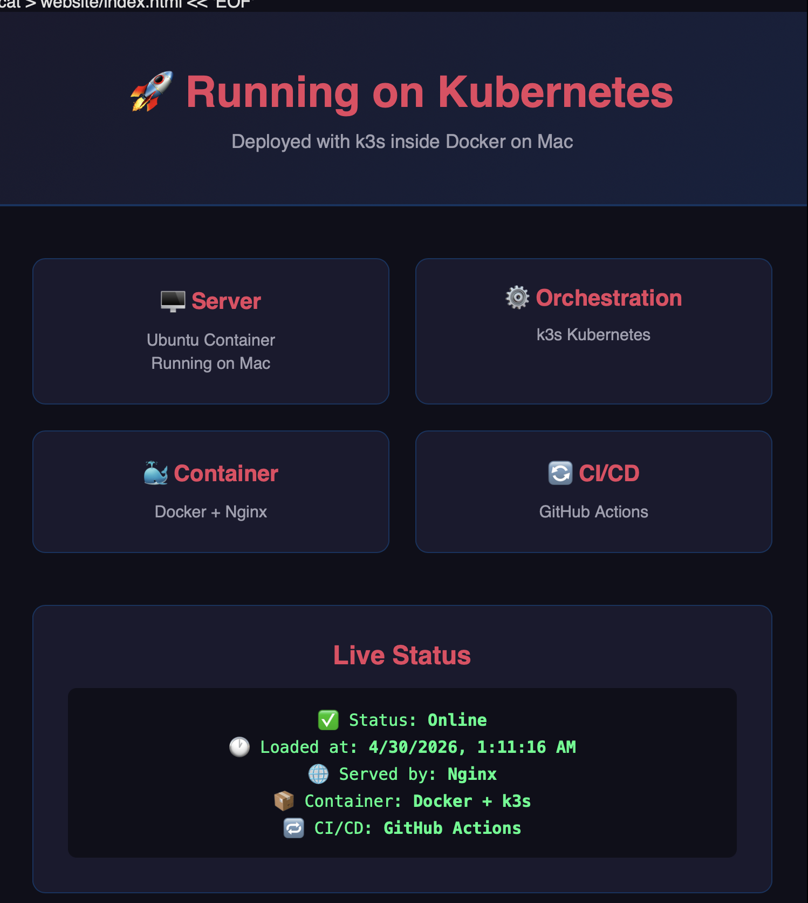

# K8s Mac Project



A full DevOps portfolio project running entirely on a local MacBook.
This project demonstrates Docker, Kubernetes, and CI/CD pipelines using GitHub Actions.

## Architecture

Mac (write code)
↓
GitHub (stores code)
↓
GitHub Actions (CI/CD pipeline)
→ Builds Docker image
→ Pushes to GitHub Container Registry
↓
Kubernetes (Docker Desktop v1.35.1)
→ Pulls image from ghcr.io
→ Runs the website in a pod
↓
localhost:8080 (live website)

---

## Tech Stack

| Technology | Purpose |
|---|---|
| **Docker** | Containerizes the Nginx website |
| **Kubernetes (k8s)** | Orchestrates and manages containers |
| **GitHub Actions** | CI/CD pipeline — builds and pushes on every push |
| **GitHub Container Registry** | Stores the Docker image |
| **Nginx** | Web server inside the container |

---

## Project Structure

k8s-mac-project/
├── Dockerfile                  # Recipe to build the website image
├── website/
│   ├── index.html              # Main webpage
│   ├── style.css               # Styling
│   └── app.js                  # Live status JavaScript
├── k8s/
│   ├── deployment.yaml         # Tells Kubernetes how to run the container
│   └── service.yaml            # Exposes the website to the network
└── .github/
└── workflows/
└── deploy.yml          # CI/CD pipeline definition


---

## CI/CD Pipeline

Every time code is pushed to `main`:

1. **CI** — GitHub Actions builds a fresh Docker image
2. **CI** — Pushes the image to GitHub Container Registry (`ghcr.io`)
3. **CD** — Kubernetes pulls the latest image and redeploys

---

## 🚀 How to Run Locally

### Prerequisites
- Docker Desktop with Kubernetes enabled
- `kubectl` installed

### Steps

**1. Clone the repo:**
```bash
git clone https://github.com/WalterRoman/k8s-mac-project.git
cd k8s-mac-project
```

**2. Create the image pull secret:**
```bash
kubectl create secret docker-registry ghcr-secret \
  --docker-server=ghcr.io \
  --docker-username=YOUR_GITHUB_USERNAME \
  --docker-password=YOUR_GITHUB_TOKEN
```

**3. Deploy to Kubernetes:**
```bash
kubectl apply -f k8s/deployment.yaml
kubectl apply -f k8s/service.yaml
```

**4. Access the website:**
```bash
kubectl port-forward service/k8s-mac-project-service 8080:80
```

Open browser: `http://localhost:8080`

---

## 📚 Key Concepts Demonstrated

- **Containerization** — packaging an app with all its dependencies
- **Container Orchestration** — Kubernetes managing container lifecycle
- **CI/CD** — automated build and deploy on every code push
- **Infrastructure as Code** — Kubernetes YAML manifests
- **Secret Management** — GitHub Secrets and Kubernetes imagePullSecrets

---

## 👨‍💻 Author

Built by **Walter Roman** as a DevOps portfolio project.